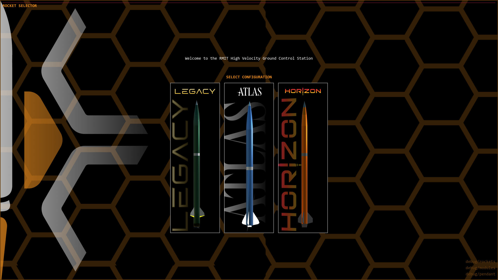
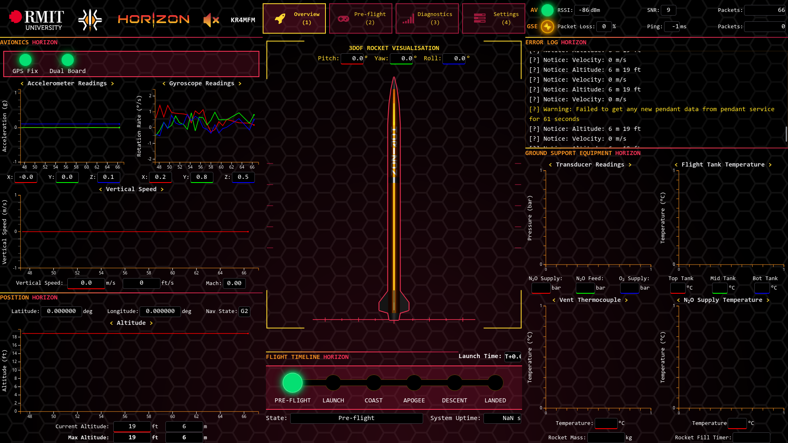
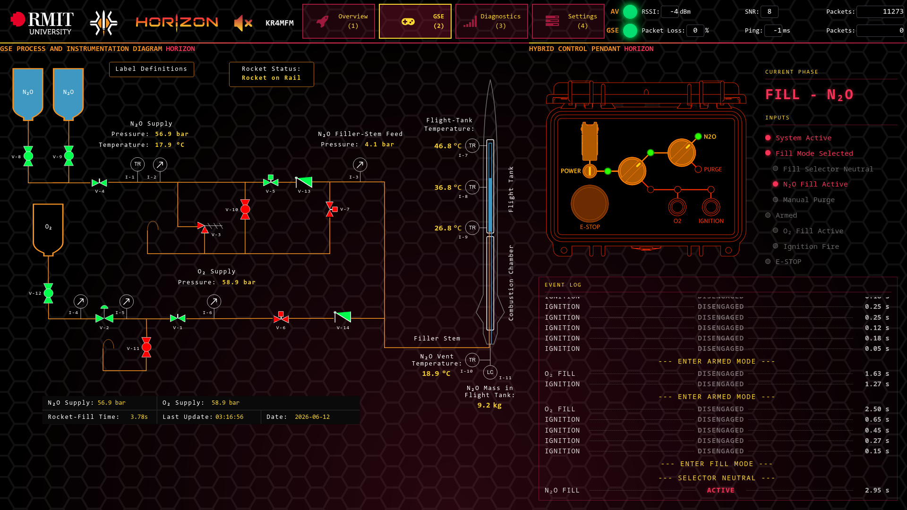

    
    
    
    

Repository for RMIT HIVE's rocketry GCS (**Ground Control Station**).

**Named after Soteria, the Greek goddess of safety and deliverance from harm.**

  
  

  

© 2026 RMIT Competition Rocketry - Licensed under the MIT License

## Documentation

### Contributing

Before working with this repository, please read [Contributing](CONTRIBUTING.md) for details on our code of conduct and the process for submitting pull requests. You can find the [AI policy](CONTRIBUTING.md#ai-policy) here.

### Table of Contents

- [Setup](docs/setup.md)
- [Usage](docs/usage.md)
- [Pendant Emulator Quick Reference](docs/pendant_emulator.md)
- [System Design & features](docs/system_design.md)
- [Development](docs/development.md)
- [Tutorials](docs/tutorials.md)
- [Frontend](docs/frontend.md)
- [Glossary](docs/glossary.md)

<!-- ### Notes

- [Brainstorming](notes/brainstorming.md)
- [Data](notes/data.md) -->

## Description

The GCS, known as SOTERIA, is Hive's computer control system for GSE control, avionics communication, and data visualisation. The core of the GCS is a single computer running SRAD software with SRAD LoRa radio hardware peripherals. All OSI layers in our networking stack above the physical protocol are SRAD for use with our Australis (avionics) ecosystem. The software converts raw serial input from physical radio interfaces into human-readable output for efficient system monitoring by the GCS operator and visualisations for observers. We use a WebSocket and a protocol buffer based IPC API to communicate with our GCS services. Our web frontend is fully SRAD aside from industry-standard libraries. The GCS operator can see if any system is performing sub-optimally via alert and warning readouts, so they can make an informed GO/NO-GO call quickly. Spectators and other team members have access to several different views detailing all telemetry from both the GSE and avionics systems

## Credit

### Ground Control Software Team

<table>
    <tr>
        <th>Name</th>
        <th>GitHub</th>
        <th>Role</th>
        <th>Year</th>
    </tr>
    <tr>
        <td rowspan=2><a href="https://www.linkedin.com/in/freddy-mcloughlan/">Freddy Mcloughlan</a></td>
        <td rowspan=2>@mcloughlan</td>
        <td>IREC 2026 lead</td>
        <td>2026</td>
    </tr>
    <tr>
        <td style="color:gray">GCS software lead & backend software engineer</td>
        <td style="color:gray">2025</td>
    </tr>
    <tr>
        <td rowspan=2><a href="https://www.linkedin.com/in/amber-taylor-20bb63264/">Amber Taylor</a></td>
        <td rowspan=2>@s4105951</td>
        <td>GCS IREC 2026 lead & senior software engineer</td>
        <td>2026</td>
    </tr>
    <tr>
        <td style="color:gray">GCS frontend lead & software developer</td>
        <td style="color:gray">2025</td>
    </tr>
    <tr>
        <td><a href="https://www.linkedin.com/in/xavier-egan-a5b3b027a/">Xavier Egan</a></td>
        <td>@XavierEgan</td>
        <td>GCS AURC 2026 lead & software developer</td>
        <td>2026</td>
    </tr>
    <tr>
        <td><a href="https://www.linkedin.com/in/twhlynch/">Tom Lynch</a></td>
        <td>@twhlynch</td>
        <td>GCS software developer</td>
        <td>2026</td>
    </tr>
    <tr>
        <td>Joseph Di Giulio</td>
        <td>@WhiteNoisex</td>
        <td>GCS software engineer & refactoring</td>
        <td>2026</td>
    </tr>
    <tr>
        <td>Zachary Everett</td>
        <td>@zachever</td>
        <td>GCS software</td>
        <td>2026</td>
    </tr>
    <tr>
        <td><a href="https://www.linkedin.com/in/marven-wijesiriwardena-252254389/">
        Marven Wijesiriwardena</a>
        </td>
        <td>@MarvenW</td>
        <td>GCS UI/UX dev</td>
        <td>2026</td>
    </tr>
    <tr>
    <td><a href="https://www.linkedin.com/in/michael-iurovetski-5742632a1/">
        Michael Iurovetski</a>
        </td>
        <td>@Iurovet</td>
        <td>GCS UX and sound effects designer</td>
        <td>2026</td>
    </tr>
    <tr>
        <td>Mohammad Ullah
        </td>
        <td>
        @mov360</td>
        <td>GCS frontend QA & Software Engineer</td>
        <td>2026</td>
    </tr>
    <tr>
        <td><a href="https://www.linkedin.com/in/trist4nl3/">Tristan Le</a></td>
        <td>@trist4nl3</td>
        <td style="color:gray">GCS simulation integration</td>
        <td style="color:gray">2025</td>
    </tr>
    <tr>
        <td><a href="https://www.linkedin.com/in/caspar-oneill/">Caspar O'Neill</a></td>
        <td>@s3899921</td>
        <td style="color:gray">GCS frontend API engineer</td>
        <td style="color:gray">2025</td>
    </tr>
    <tr>
        <td><a href="https://www.linkedin.com/in/anuk-jayasundara-ab440b1aa/">Anuk Jayasundara</a></td>
        <td>@SaviruA</td>
        <td style="color:gray">GCS 6DOF rocket visualisation</td>
        <td style="color:gray">2025</td>
    </tr>
    <tr>
        <td>Jonathan Do</td>
        <td>@J88error</td>
        <td style="color:gray">GCS frontend UI/UX design</td>
        <td style="color:gray">2025</td>
    </tr>
    <tr>
        <td>Nathan La</td>
        <td>@s4003562</td>
        <td style="color:gray">GCS data visualisation</td>
        <td style="color:gray">2025</td>
    </tr>
</table>

### Additional Ground Control Credits

<table>
    <tr>
        <th>Name</th>
        <th>GitHub</th>
        <th>Role</th>
        <th>Year</th>
    </tr>
    <tr>
        <td>Hayden Rujak</td>
        <td>@MikieCarbon</td>
        <td>GCS electronics</td>
        <td>2026</td>
    </tr>
    <tr>
        <td>Kelly Wan Wing Kai</td>
        <td>@kelly2504</td>
        <td>Hive web designer</td>
        <td>2026</td>
    </tr>
</table>

### Special thanks

<table>
<tr><tr>
    <tr>
        <td><a href="https://www.disti.com/">The DiSTI Corporation</a></td>
        <td>For access to GL Studio to accompany the GCS</td>
    </tr>
    <tr>
        <td><a href="https://www.linkedin.com/in/aleksei-eaves-b09133343/">Aleksei Eaves</a> - @s4014876-rmit</td>
        <td>For 2026 flight computer firmware development</td>
    </tr>
    <tr>
        <td><a href="https://www.linkedin.com/in/trist4nl3/">Tristan Le</a> - @trist4nl3</td>
        <td>2026 GSE (Ground Service Equipment) & electronics lead</td>    
    </tr>
    <tr>
        <td><a href="https://www.linkedin.com/in/jonathan-chandler-03474b1ba/">Jonathan Chandler</a></td>
        <td>2025 GCS Lead. The all-knowing being of ground control and operations</td>
    </tr>
    <tr>
    <td><a href="https://www.linkedin.com/in/matthewricci-embedded/">Matthew Ricci</a></td>
        <td>Flight computer <a href="https://github.com/RMIT-Competition-Rocketry/Australis-Avionics-firmware">avionics firmware</a> lead</td>
    </tr>
</table>

And to all those at RMIT Hive!

## Software Development Components

This project was built using the following tools, languages and systems.

- Radio commuincation:
  - [LoRa](https://en.wikipedia.org/wiki/LoRa) with both COTS and SRAD hardware
- Multithreaded data ingestion server
  - Written in C++
  - Built with [ZeroMQ](https://zeromq.org/) for IPC communication
  - IPC Data serialisation with [Google's Protocol Buffers](https://protobuf.dev/)
- Multithreaded CLI based process manager
  - Written in Python
  - Includes a device emulator for internal system tests that attaches from the hardware layer to create a fake unix device file at `/dev/`

**Cool fact**: Our GCS runs at less than 1% CPU utilization on a Raspberry Pi 5 during regular use.

## Screenshots

### 2026

| | |
| ---: | --- |
|  Rocket selection screen | 
| Horizon main view | 
| Horizon GSE (pre-flight) view |  |

### 2025

| Web interface (main view) | Custom GSE HMI page | CLI |
| --- | --- | --- |
|  |  |  |

## Conference Appearances

[PyCon AU 2026](https://2026.pycon.org.au/schedule/9KBBEQ/), August 2026

## License and Attribution

This project is licensed under the MIT License.

If you use or modify this software, you **must retain** the original copyright
notice and license in all copies or substantial portions of the Software.

Attribution must be clearly displayed in any redistributed or derivative works.

Please credit: **RMIT Competition Rocketry** and the **Hive GCS Software Team**.

See the [LICENSE](LICENSE) file for full terms.
