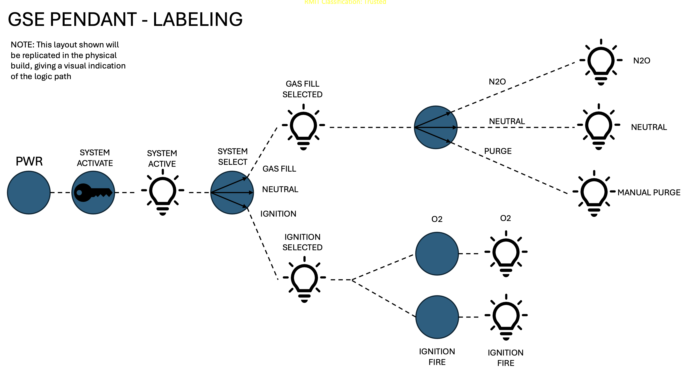
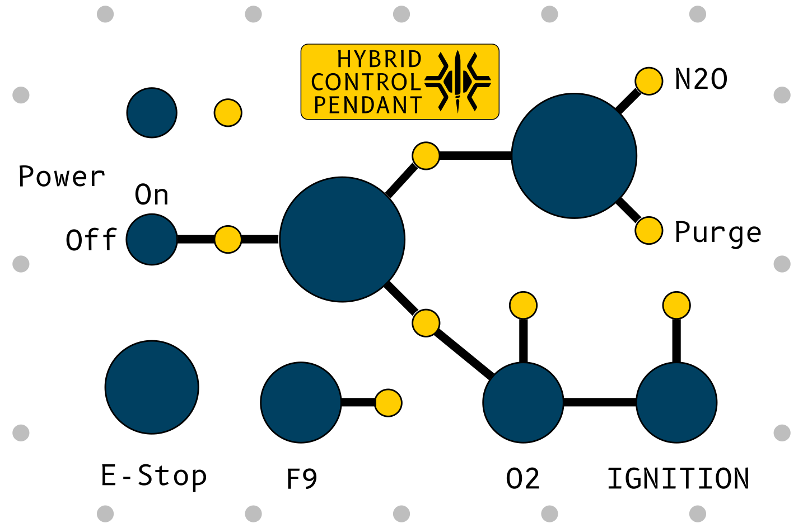
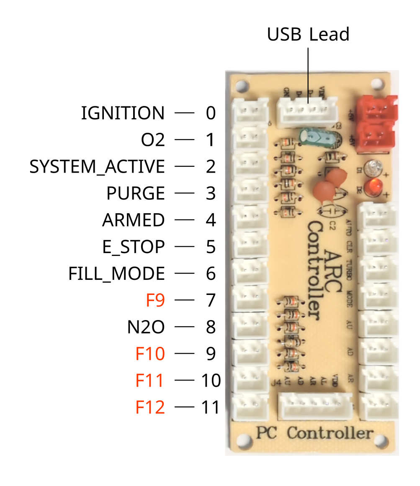
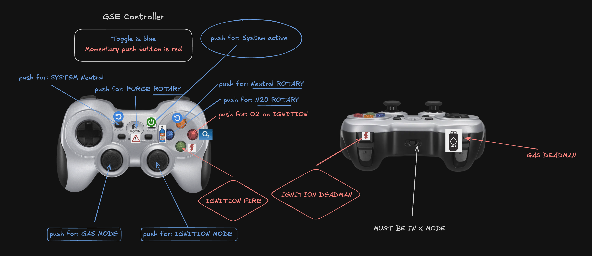

# Control Pendant

## Reference Schematics

## Wiring

The current iteration of the control pendant uses an ARC-666 Arcade Controller board, which converts the switch signals into USB-HID signals for a computer to easily understand. 

The pendant should be wired up following the below diagram:

Please note that F9, F10, F11 and F12 do NOT refer to keys on the keyboard, they're simply spare utility inputs that can be used for various purposes. Not every pendant includes controls for them.

## Pendant Emulator
### Keyboard Mapping

> [!WARNING]
> This emulator always assumes that the physical translations for mechanical inputs are as follows:
> - System is always powered on, but not activated
> - Rotary is in neutral by default
> - System select is in neutral by default
> - Push in controller stick to select a mode and hold deadman to engage. This emulates the spring loaded rotary switch

> [!CAUTION]
> Start controller in `X` mode with the switch at the front. Under no circumstances do you change this or the connection will break and a restart is required.

### Example Step By Step Guides For A Controller User

All steps require system to be on. Toggle the ON button to turn system on.

#### Uncontrolled Purge (Emergency)

1. Pull the leads out of the E5 PCB.

This disables the GCS radio and engages the GSE packet loss shutdown procedure

#### Controlled Purge

1. Press the gas stick
2. Press the Logitec button in the middle
3. Hold gas deadman to open purge gauge

#### Fill Rocket With N2O

1. Press the gas stick
2. Press N2O
3. Hold the gas deadman to fill

#### Ignition sequence

1. Press the ignition stick
2. Hold the ignition deadman
3. Hold O2 to begin ignition
4. Hold FIRE to ignite rocket

---

[Home](../README.md)
