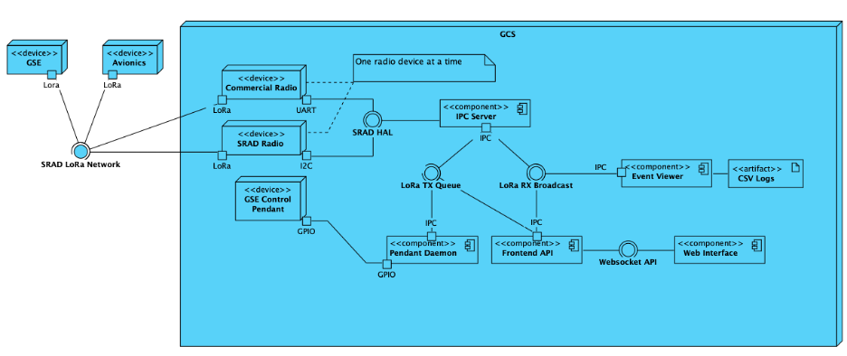

# System Design

**TODO**: Please formalise this at some point

There are 3 physical devices in the GCS system. The control pendant, radio and the computer. The control pendant is a physical tactile controller that operates the GSE. The radio is interchangeable between commercial solutions and SRAD solutions with a custom Hardware Abstraction Library (HAL).

## High Level Software Design

The main server in the system is responsible for reading data in from the radio and writing data back out on the radio in accordance with our SRAD networking protocols. These protocols operate on a UDP request-reply basis. The GCS will say 'do xyz and tell me what your system status is' and the device will reply back. The GCS server then broadcasts received data throughout the computer to each 'service' which are isolated programs that run completely decoupled from any other service. This architecture means that if a service was to completely and catastrophically fail, it would have no effect on any other non-dependant service. Each service would read in data from the broadcast and perform it's own computation. If a process wanted to communicate to the user, it could write data to STDOUT and the process manager system would collage each service's output onto the one terminal screen. All of the output is automatically prefixed with `DEBUG`, `INFO`, `WARNING` and `ERROR` levels, colour coded, and automatically logged to file throughout system operation.

## Service Descriptions

GCS services include the event viewer for notifying the user of GSE and avionics information whilst logging all radio packet data to a csv file for low resolution post-flight analysis. The frontend API communicates with each web client for simultaneous reading and writing of data to the web visualisation and control interface. And the pendant daemon runs in the background to poll a tactile hardware controller to send commands to the GSE such as 'fill with N2O'.

## Features

With this system, we can use any radio we want, as long as a simple hardware abstraction library can be written for it. Currently only half-duplex (1 device communicating at a time) communication is supported, but full duplex communication (2 devices communicating to each other at once) can be implemented quite easily in the future if we use 2 different frequencies. We know immediately if anything in out rocketry system is misbehaving. Avionics systems have feedback on rocketry components and much of our GSE has solenoid feed-back, thermocouples and extra monitoring features supported. All of this data is send to the GCS and presented to the operator in both the textual output and the frontend web design with visually alerting icons and warning messages. This allows us to troubleshoot easily and make GO/NO-GO calls confidently.

Many primitive monitoring applications show everything. Our system understands that not everything is important. There is no need to show the reading of every sensor as soon as you receive information. Our system only shows information that may be useful to the operator to reduce clutter and response time. All of the data appears in real time. We can see as soon as the rocket is ready for ignition, or as soon the rocket has hit apogee. As our system also connects to our GSE and offers a web interface, we can present real time GSE feedback to pad personnel on a tablet out near the launch rail This system will work seamlessly for any vehicle that has an Australis flight computer or follows the Australis networking protocol. Various settings and models may need to be updated to fit each rocket's flight profile.

## File Diagram

This is a bit of a mid level explanation of how the service manager operates

<!--
This is also in /assets as a .excalidraw file
-->

<!-- ---

WIP

see working changes on [master design Excalidraw file](https://github.com/RMIT-Competition-Rocketry/GCS/blob/main/docs/assets/master-design.excalidraw) -->

## Design Philisophy

Author: Freddy

April 2026

### Overall Purpose

This entire sytsem was designed with the following goals and purposes in mind:

- Reliably control avionics, GSE
- Provide the framework and features for rocket telemetry visualisation (for the live telemetry competition).

And there are many sub goals that stem from those listed above.

### System goals

No point working on this unless you understand what the intention for the user is.
This system is used for:

- Lab testing any device that requires external communication (GSE or AV)
- On-campus propulsion tests
- Static fires
- Launch activities

Hence, the system needs to abide by the following design rules.

1. Support comprehensive, verbose and useful debugging. And allow for post-mortem analysis.

The GCS is meant not only to control everything, but also to listen to everything that is going on in the Hive network. So make sure you log EVERYTHING that is useful, and log it at the appropriate level. It currently logs every single byte that goes in and out of the system, the time it happened and associated state transitions. Among other things. Have a read through `logs/`

At the end of the day, if there's a problem with anything, you should be able to go through the logs and figure it out. There is no point in testing something if you can't analyse the results.

Don't worry about the debug output being too much, because it's hidden in release/run mode. Which leads to my next point

2. Keep the operator informed, and not overwhelmed

This is related to my first point. You want the operator to know everything that is going on across every system, device and process. But they don't need to know that you've updated some random variable somewhere that means nothing to them. Hence why you use the `debug` logging level for things only useful to the developer, and everything else should be `info` or above. You can even set the logging level to `warning` if you only care about things going wrong. But you will obviously lose a lot of valuable information from the `info` level.

Logging levels are hierarchical. When you set a desired logging level, you are setting an actual integer threshold for levels below that not to be shown.

| Name | When to Use | Example | Output Frequency |
| :--- | :--- | :--- | :--- |
| **DEBUG** | Diagnostic info for developers. Useful during the dev phase or while troubleshooting. | `Starting middleware build [cmake --build] with: ['cmake', '--build', '.', '--parallel', '8']` | **High** |
| **INFO** | Standard event information. | `Middleware server started successfully` | **Moderate** |
| **SUCCESS** | Same as info, but highlighted for important pass/fail events. | `GPS fix aquired` | **Low** |
| **WARNING** | Something unexpected happened, but the system is probably still fine. | `AV Signal lost` | **Low** |
| **ERROR** | A specific operation failed. The app is still running, but a feature is now broken. | `Missing required socket path argument` | **Very Low** |
| **CRITICAL** | Total system failure. A system cannot continue, and something is very broken. Sometimes indicates data corruption or confirmation that the rocket has actually just exploded | `FC HAS DECIDED TO STOP BROADCASTING` | **Minimal/Zero** |

> [!NOTE]
> Noting that `rocket dev` sets the minimum logging level as `debug`, and `rocket run` sets the level to `info`.

Every programmer should be aware of [error fatigue](https://www.ibm.com/think/topics/alert-fatigue). If someone looks at the same error over and over again, they will just ignore it. Make your warnings and errors actually mean something.
When someone goes to launch a rocket or test a motor, you sometimes only have a single chance to make it work. It's the culmination of months of work and 10's of thousands of dollars. The GCS operator will be locked the hell in on that screen, and they will need to know EVERYTHING that is happening. I cannot emphasise how stressful this is. This is why useless warnings need to be removed. Ideally, **you should only show a warning if something has gone wrong**, and it should immediately tell the operator what went wrong (if possible). We will hold/abort a launch if anything loses signal.
If I see a warning during the launch director's countdown, I want to be able to make up my mind for an abort call ASAP. Maybe it's time we make a GCS playbook for common warnings?

Consider the difference between these 2 warnings.

> WARNING: Timeout on AV sequence lock

and

> WARNING: AV NO SIGNAL

This was a change that was made late in the 2025 development cycle to better inform an operator what is actually going on. Because under the hood, we determine if AV has lost signal by checking if the AV sequence lock class has exceeded its timeout threshold. Although the first warning is programmatically explicit and better relates to the actual implementation, the latter makes sense to **everyone else**. People will use this system who have no idea how it works. You're better off to make the warnings super obvious to reduce the cognitive load of the user and erase any possible confusion so they can make calls as quick as possible.
I understand not every warning or error is directly related to launch approval. If it is a super rare warning or error, more ambiguity is fine, but if it requires a launch hold or abort, add information like 'xyz has now stopped working' where it makes sense.

3. Reliability and consistency

Avoid flakiness and race conditions like everything depends on it. Because it does.
Test the hell out of this system prior to every propulsion test and launch. If something doesn't add up, or something is annoying you because it's flaky or not consistent, hunt it down and squash it. We use a 35kV ignitor that will kill someone if it's ignited at the wrong time. We have an entire pressurised gas system that will also kill someone if it is operated incorrectly. Although most of those issues are protected by safe engineering practices and rigorous operational procedure, the last thing you want is a GCS with unreliable control behaviour.

Also, don't be too scared to make changes to a system that impacts this behaviour, but just make sure to test it!

4. Avoid all possible sources of human error

> If your system requires human perfection, your system sucks ass

This whole system is on a computer. If some action can be safely automated instead of the operator doing it, automate it.

The number one cause of issues with most engineering tasks is human error. If you expect someone to follow a long list of procedures, careful instructions and rules, they will become increasingly more likely to introduce errors.

This is why `rocket run` exists, and why we have startup scripts on the desktop. `rocket run` takes one argument `gse-only` and reads everything else from the config. It attempts to be as deterministic as possible from the last time you ran the system. Importantly, it doesn't rebuild anything. Which is why you, as an operator, need to manually build a new release binary so you understand the system may have new behaviour. Currently, to start the software, you just turn on the computer, double-click a startup script on the desktop and off you go. If you need to change your frequency, you can edit the config.

But we still need checklists of course. But just consider how much of that checklist can be automated to reduce human error without taking away any important control over the system.

Also, try to break your system (during runtime testing) in every way. Kill processes, unplug USBs, and open Prime95. See what happens and protect against it!

 

Although, this is not an invitation to automate the fill sequence. That one needs to be human-controlled only. That's where physical hardware safety comes in, like key interlocks, LEDs, momentary buttons and switches. Also, it's straight-up banned at IREC. I think you can imagine why this is human-controlled only. Once again, another reason to have an awesome checklist.

---

[Home](../README.md)
